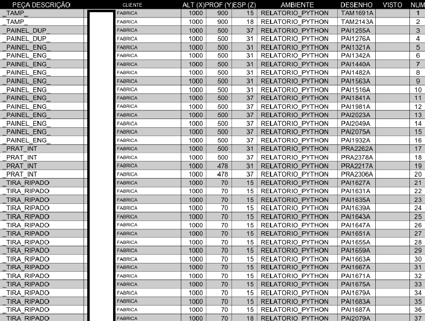

# 📊 Relatório de Peças com Python 🍌

Bem-vindo ao projeto de geração de relatórios em PDF para peças usando Python! Este script lê dados de um arquivo Excel e gera um relatório PDF detalhado com base nas informações fornecidas.

## 🚀 Funcionalidades

- **Leitura de Arquivo Excel:** O script pode ler arquivos Excel com extensão `.xls` ou `.xlsx`.
- **Filtro e Organização:** Filtra dados com base em critérios específicos e organiza o relatório conforme desejado.
- **Geração de PDF:** Cria um relatório em PDF formatado e estilizado para fácil leitura.

## 📂 Download

Você pode baixar a build zipada do projeto diretamente do GitHub:

- [Baixar o projeto](https://github.com/srfrogui/giacomoListagem/releases/latest/download/Embananador-win32.zip)

## 🛠️ Requisitos

Certifique-se de ter os seguintes pacotes Python instalados. Você pode instalá-los executando:

```sh
pip install -r req.txt
```

Onde `req.txt` deve conter:

```
pandas
reportlab 
tk
xlrd
```

## 📝 Como Usar

1. **Clone o repositório ou baixe o script Python.**
2. **Instale os requisitos listados acima.**
3. **Execute o script Python:**

    ```sh
    python embananador.py
    ```

4. **Selecione o arquivo Excel quando solicitado.**
5. **Escolha o tipo de relatório que deseja gerar (por enquanto, apenas o Relatório de Peças está disponível).**
6. **O relatório será salvo como um arquivo PDF no mesmo diretório do arquivo Excel.**

## 📂 Estrutura do Projeto

- **`embananador.py`:** Script principal para geração de relatórios.
- **`req.txt`:** Arquivo de requisitos com as dependências necessárias.

## 📜 Exemplo de Saída

Abaixo está um exemplo de como o relatório gerado pode parecer:



## 💬 Contribuições

Sinta-se à vontade para contribuir com melhorias, correções ou novas funcionalidades. Se você tiver sugestões ou encontrar problemas, abra uma issue ou envie um pull request!

## 👋 Agradecimentos

Agradecemos por usar este projeto. Se você gostou, por favor, dê uma estrela! ⭐
TMJ Alexander apreciador de bananas <###333
Se você tiver alguma dúvida ou precisar de ajuda, sinta-se à vontade para entrar em contato.

---

🍌 **Divirta-se gerando relatórios!** 🍌
